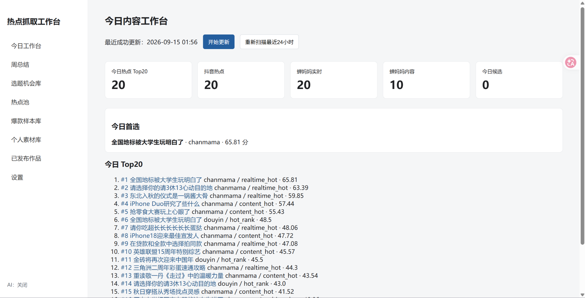
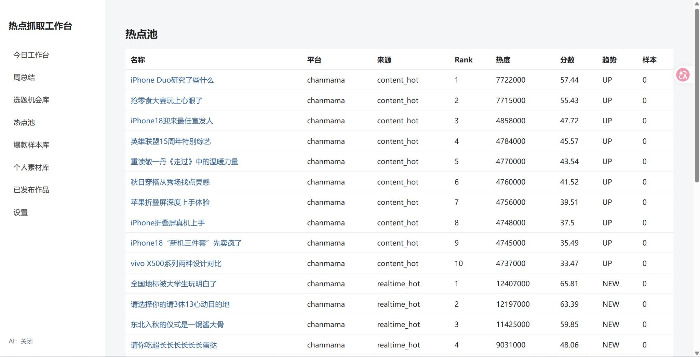
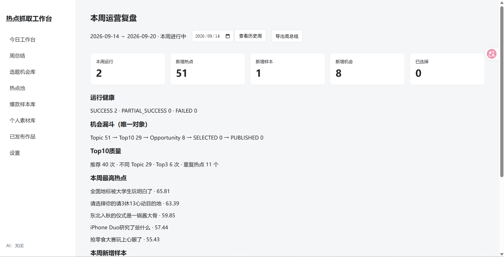
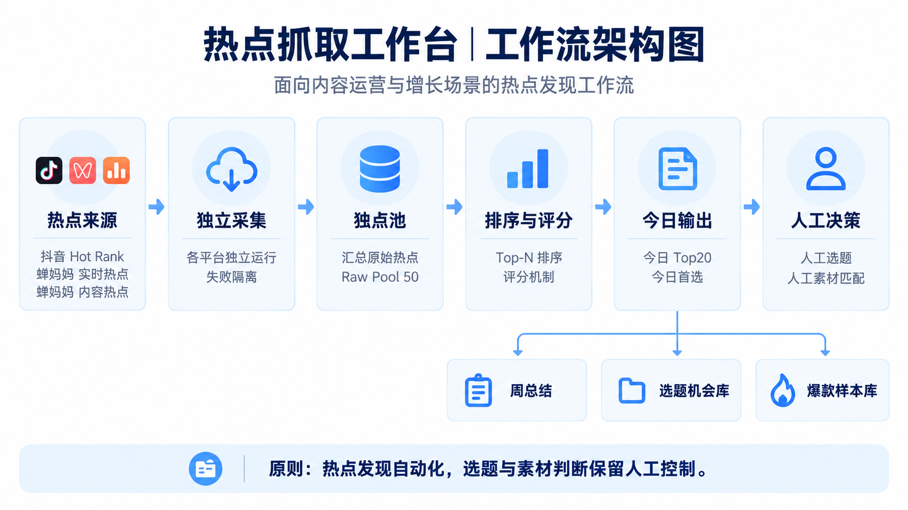

# AI 热点发现平台

一个面向内容运营与增长场景的热点发现平台，通过自动采集平台公开热点榜单、构建结构化热点池并生成每日 Top20，降低人工寻找热点的时间成本。

---

## 项目背景

在内容运营和新媒体工作中，“找热点”通常需要运营人员每天反复浏览多个平台。

传统方式存在几个明显问题：

- 不同平台热点分散
- 每天需要重复浏览多个榜单
- 热点数量多，人工比较成本高
- 不同平台的数据结构不同
- 很难持续沉淀历史热点
- “发现热点”和“判断能不能做内容”经常混在一起

因此，我尝试将热点发现过程拆成一个可持续运行的工作流：

**平台热点榜单 → 自动采集 → 热点池 → 统一排序 → 每日 Top20 → 人工选题判断**

核心目标不是让 AI 自动完成内容决策，而是：

> 自动完成高重复的信息发现工作，把真正需要业务判断的环节保留给人。

---

## 项目目标

这个项目主要解决三个问题：

1. 如何减少运营人员每天人工浏览多个热点榜单的时间
2. 如何将不同平台热点统一成可比较、可管理的数据结构
3. 如何明确自动化与人工判断之间的边界

最终形成：

**热点发现自动化 + 选题判断人工化**

的内容运营工作流。

---

## 产品展示

### 今日内容工作台



首页集中展示当天热点采集与排序结果，包括：

- 今日热点 Top20
- 抖音热点数量
- 蝉妈妈实时热点
- 蝉妈妈内容热点
- 今日首选
- 热点综合评分

运营人员不再需要分别打开多个平台查看热点榜单，可以直接在一个工作台中完成每日热点浏览。

---

### 热点池



所有采集到的热点会统一进入结构化热点池。

主要字段包括：

- 热点名称
- 平台
- 榜单来源
- Rank
- 热度
- 综合分数
- 趋势
- 样本数量

这样不同平台的数据可以进入统一的数据结构中进行比较和管理。

热点池同时保留：

**平台来源 + 榜单来源 + 排名 + 热度**

避免跨平台整理后丢失原始来源信息。

---

### 周运营复盘



除了每日热点发现，系统还会对运行结果进行周度汇总。

当前复盘维度包括：

- 本周运行次数
- 新增热点
- 新增样本
- 新增机会
- 运行健康状态
- Top10 推荐质量
- 重复热点数量
- 本周最高热点

通过周度复盘，可以观察热点发现工作流本身是否稳定，以及输出质量是否发生变化。

---

## 工作流架构



整体流程为：

**热点来源 → 独立采集 → 热点池 → 排序与评分 → 今日输出 → 人工决策**

### 热点来源

当前主要采集：

- 抖音 Hot Rank
- 蝉妈妈实时热点
- 蝉妈妈内容热点

系统从平台自身的公开热点榜单发现热点，而不是通过关键词搜索热点。

---

### 独立采集

不同平台使用独立采集链路。

核心原则：

**各平台独立运行，失败互不影响。**

例如：

```text
抖音采集失败
        ≠
蝉妈妈采集失败
